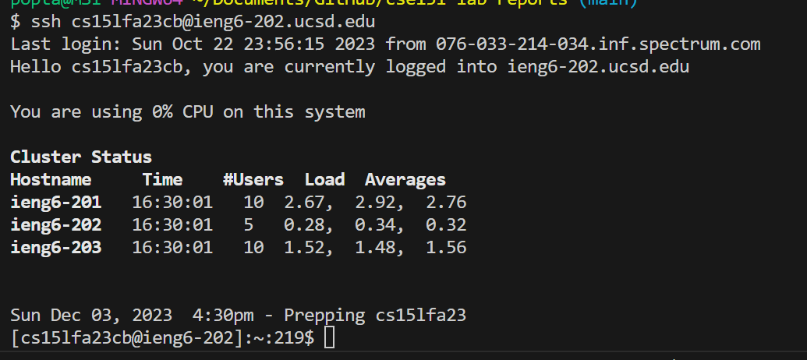
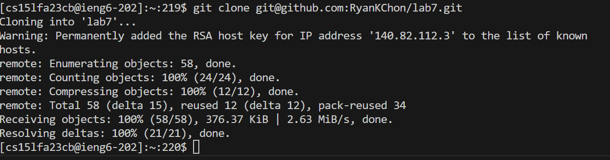
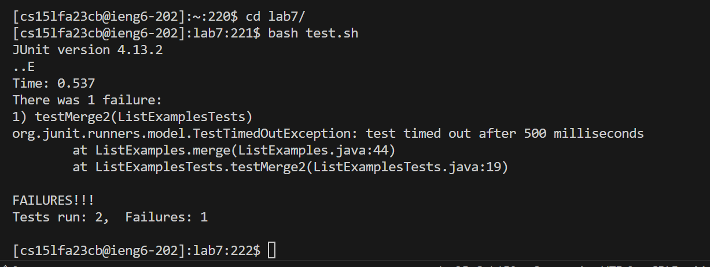
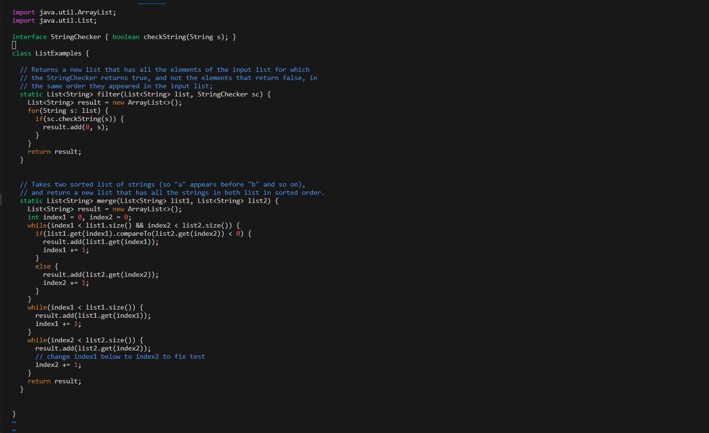
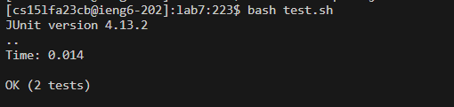
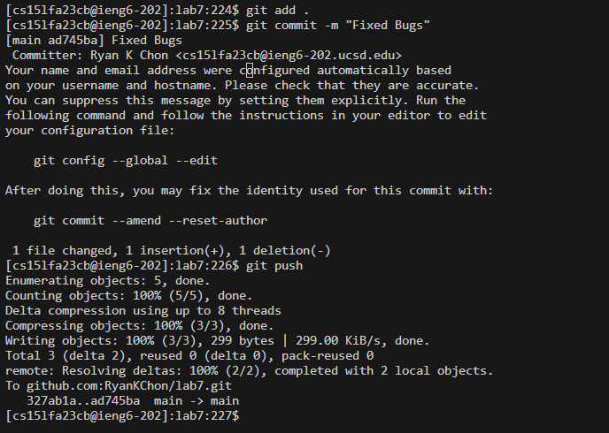

# Lab 4 Ryan Chon

## Step 4 
`Log into ieng6`


Steps to Reach this command

```<up> <enter>```

ssh cs15lfa23cb@ieng6-202.ucsd.edu was one up in the search hitory so I used up arrow to access it

## Step 5
`Clone your fork of the repository from your Github account (using the SSH URL)`



Keys Pressed

``` git clone <ctrl + v> <enter> ```

I copied the link from the GitHub Repository from the ssh tab and used ctrl v in order to paste it into the terminal. 

## Step 6

`Run the tests, demonstrating that they fail`

Keys Pressed
```
cd l<tab> <enter>
bash t<tab> <enter>
```
I used cd l+tab to quick complete l to lab7/ because I need to be in the lab7 directory/path. 

Once inside the path I ran the bash script test.sh by using bash t + tab in order to quick complete it. This ran the junit test ListExamplesTest.java

## Step 7
`Edit the code file to fix the failing test`




Keys Pressed:
```
vim ListExamples.java <enter>
(Inside Vim) <:44> 
<e>
<r> + 2
<wq>
```
While in the lab7 directory, I used vim ListExamples.java in order to open the java file with vim. 

Inside vim I used :44 to jump to line 44 because I knew the bug was on that line. 

I used e in normal mode to jump to the end of the first word which was index1.

I then pressed r and then 2 inorder to replace the 1 in index1 with 2.

I then pressed :wq in order to exit and save the changes I made in vim.

# Step 8

`Run the tests, demonstrating that they now succeed`



Keys Pressed:
```
<up>
<up>
<enter>
```

The requred command to run the tests "bash test.sh" was two search history up in the command line, so I just pressed up two times and pressed enter/


# Step 9
`Commit and push the resulting change to your Github account (you can pick any commit message!)`



Keys Pressed
```
git add . <enter>
git commit -m "Fixed Bugs" <enter>
git push <enter>
```
I used "git add . " to add the entire current folder (lab7) to the next commit because 
it is what I am used to doing. I used "git commit -m "Fixed Bugs" " in order to commit the changes and to tell that I fixed the bugs in the files. And I used "git push" in order push the changes into the forked repo.