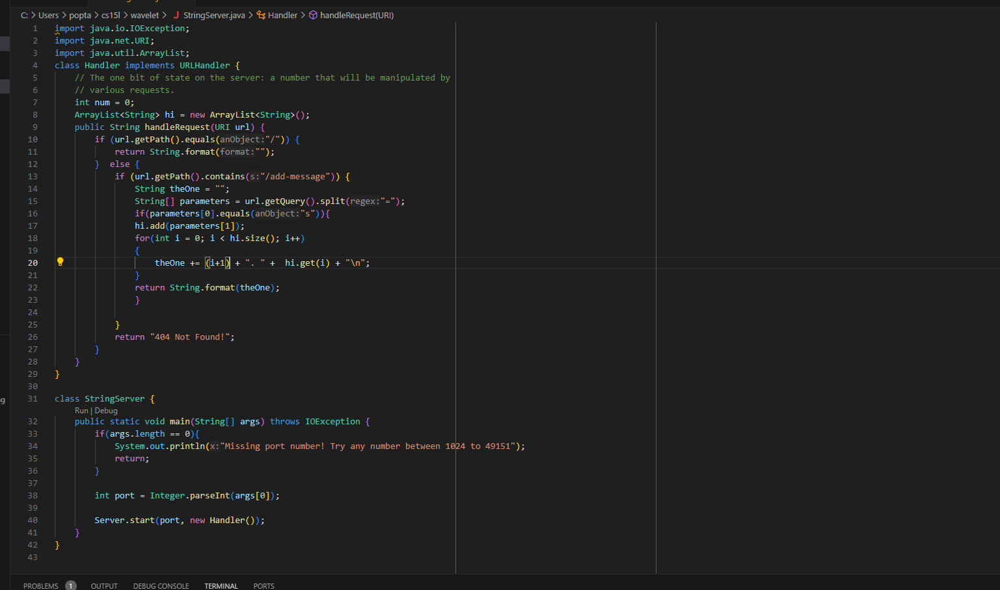
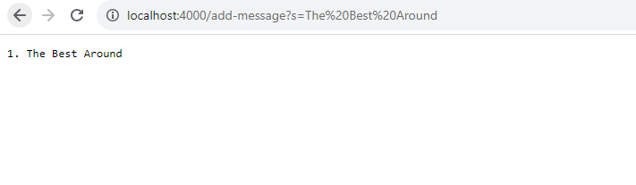
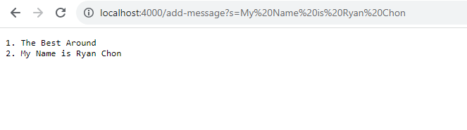
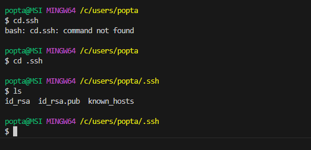
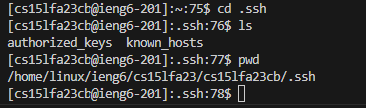
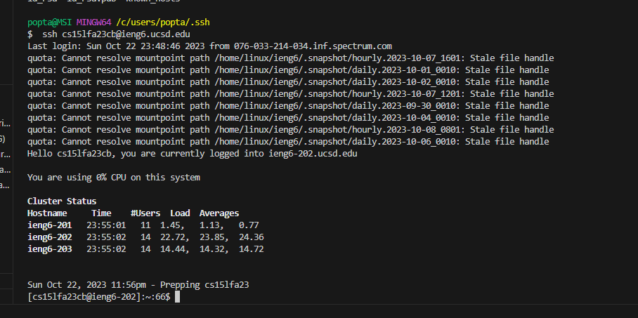

# Part 1 

 ---

---

## Which methods in your code are called?
* For both the first and the second one the public String handle request are called 

## What are the relevant arguments to those methods, and the values of any relevant fields of the class?
* The relevant arguments to those methods are the URI url. Also used: add(), format(), size(), getPath(),equals()
* The relvant fields of the class are the ArrayList hi and the int num.
## How do the values of any relevant fields of the class change from this specific request? If no values got changed, explain why.
* For the first one

Arraylist hi starts out as an empty array list. Once the query is put in, the empty String theOne is created as well as the String array parameters have ["s"] ["The Best Around"] as its values. Then "The Best Around" is added to hi and theOne is formated to be 1. The Best Around.

* For the Second one

ArrayList hi has one string in it being "The Best Around". Once the second query is in The One is created again as well as the String array parameters which becomes  ["s"] ["My Name is Ryan Chon"]. Then "My Name is Ryan Chon" is added to hi and theOne is concaneted to be in the formate of:
1. The Best Around
2. My Name is Ryan Chon

# Part 2e

## 1 

## 2 

## 3. 

# Part 3
The main thing I learned from labs week 2 and 3 was all of the stuff concerning the web server nad URLHandler.
I've set up a server before but actually interacting with it by inputting different queries was new to me.
SSHing is something I've also done in the past but I've largely forgot about it so learning it again during lab 
was a good experince.