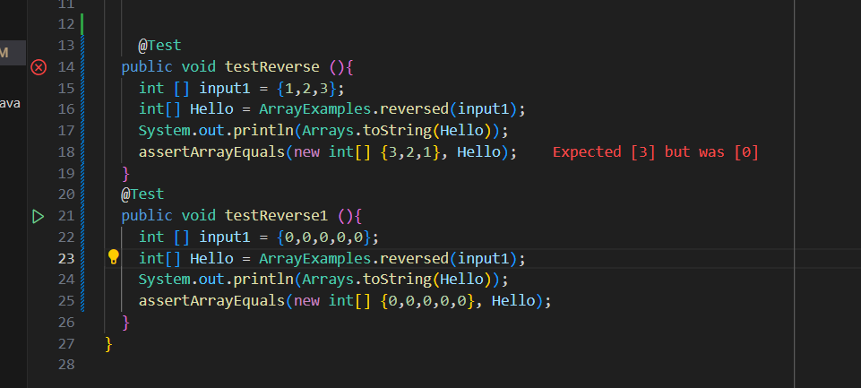
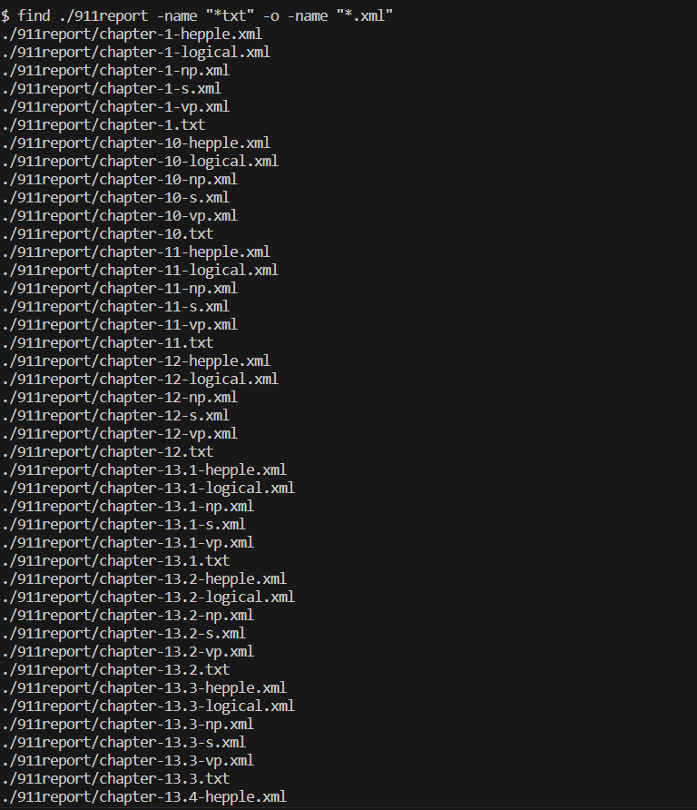
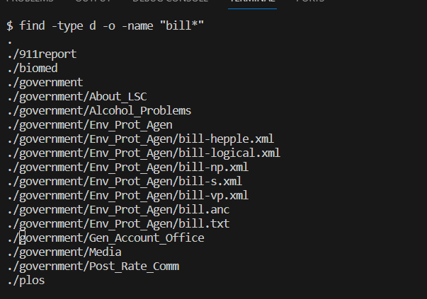
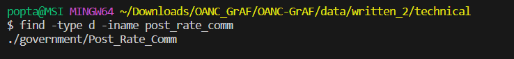
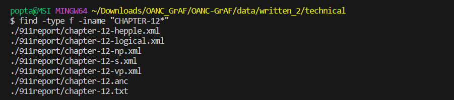

# Lab 3 Ryan Chon

## Part 1
* A failure-inducing input for the buggy program, as a JUnit test and any associated code (write it as a code block in Markdown)
```
 @Test
  public void testReverse (){
    int [] input1 = {1,2,3};
    int[] Hello = ArrayExamples.reversed(input1);
    System.out.println(Arrays.toString(Hello));
    assertArrayEquals(new int[] {3,2,1}, Hello);
  }

```

* An input that doesn’t induce a failure, as a JUnit test and any associated code (write it as a code block in Markdown)
```
 @Test
  public void testReverse1 (){
    int [] input1 = {0,0,0,0,0};
    int[] Hello = ArrayExamples.reversed(input1);
    System.out.println(Arrays.toString(Hello));
    assertArrayEquals(new int[] {0,0,0,0,0}, Hello);
  }
```

* The symptom, as the output of running the tests (provide it as a screenshot of running JUnit with at least the two inputs above)


* The bug, as the before-and-after code change required to fix it (as two code blocks in Markdown)

## Before
```
  static int[] reversed(int[] arr) {
    int[] newArray = new int[arr.length];
    for(int i = 0; i < arr.length; i += 1) {
      arr[i] = newArray[arr.length - i - 1];
    }
    return arr;
  }
``` 

## After 

```
 static int[] reversed(int[] arr) {
    int[] newArray = new int[arr.length];
    for(int i = 0; i < arr.length; i ++)
    {
      newArray[i] = arr[i];
    }
    for(int i = 0; i < arr.length; i += 1) {
      arr[i] = newArray[arr.length - i - 1];
    }
    return arr;
  }
```
The problem with the original code is it just made a new array of size arr.length. It's elements are initially just going to be initialized as 0, so assign arr's elements to the elements of newArray just results in everythin being set to zero. Adding the for loop makes newArray be have the exact same elements so traversing through it backwords correctly gives the reverse order.

# Part 2

## Find Command

* -next (https://linuxhandbook.com/find-command-examples/)
.PNG)
This allows to find a file or directory with the name starting with bill in any of the within and nested in the working directory
.PNG)
This command allows us to find any file or directory within a given directory ending in a specific combination of characters

* -type (https://linuxhandbook.com/find-command-examples/)

.png)
This version of the command type with d following it finds the name of all of the directories nested within the working directory

.png)
This version of the commmand type with f following it finds all files with the name starting with preface. This is useful if you only want to search for files and not directories with a specific name.

*-o  (https://linuxhandbook.com/find-command-examples/)

This command finds all files in a directory ending in .txt or .xml. The -o option acts as an "or" statement and allows us to look for multiple files


This commands finds all directories nested in the working directory and all files named bill residing or nested in the working directory. This is useful if you want to find both a directory or a file
* -iname (https://linuxhandbook.com/find-command-examples/)


This command finds all directories with the name post _rate_comm within and nested inthe working directory not case sensitive. This can be useful if you just want to find directories without caring about capitilization

This command finds all files starting with chapter 12 within and nested inthe working directory not case sensitive. This can be useful if you just want to find files without caring about capitilization