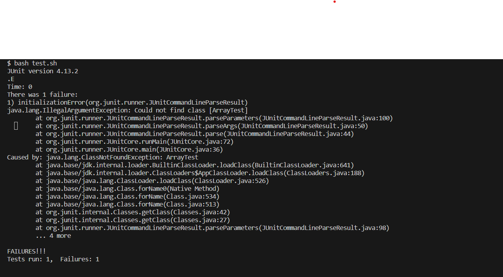
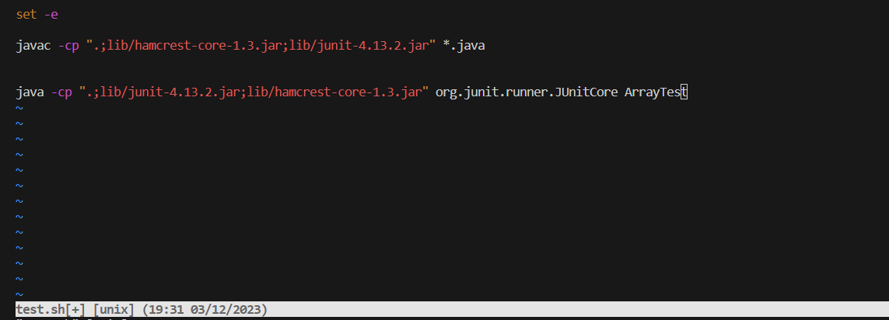
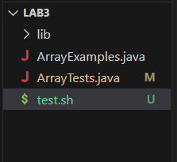

# Lab 5 Ryan chon

## Step 1

Student Temp: Hello, I downloaded the ArrayExamples and ArrayTest java Files from the GitHub repo and made a bash Script in order to run the junit test, but this error keeps popping up. I'm not too familiar with the technical wording, so I don't really know how to tackle this problem.

## 2 Response from the TA
TA: Hi temp! As it stands the problem with your output stems from a wrong input for running JUnit. It says that it cannot find ArrayTest, so try to open the bash script in vim to make sure you got the command to run JUnit to be correct.

## 3 Student response to TA


After using vim to open test.sh the student would be able to find that he had written ArrayTest for the java -cp command. The test filename is actually ArrayTests, so the missing s had resulted in the cannot find class error.

## Step 4 Scenario

### File and directory structure


File Contents 

`ArrayExamples.java`
```
public class ArrayExamples {

  // Changes the input array to be in reversed order
  static void reverseInPlace(int[] arr) {
    for(int i = 0; i < arr.length; i += 1) {
      arr[i] = arr[arr.length - i - 1];
    }
  }

  // Returns a *new* array with all the elements of the input array in reversed
  // order
  static int[] reversed(int[] arr) {
    int[] newArray = new int[arr.length];
    for(int i = 0; i < arr.length; i += 1) {
      arr[i] = newArray[arr.length - i - 1];
    }
    return arr;
  }

  // Averages the numbers in the array (takes the mean), but leaves out the
  // lowest number when calculating. Returns 0 if there are no elements or just
  // 1 element in the array
  static double averageWithoutLowest(double[] arr) {
    if(arr.length < 2) { return 0.0; }
    double lowest = arr[0];
    for(double num: arr) {
      if(num < lowest) { lowest = num; }
    }
    double sum = 0;
    for(double num: arr) {
      if(num != lowest) { sum += num; }
    }
    return sum / (arr.length - 1);
  }


}
```

`ArrayTests.java`
```
import static org.junit.Assert.*;
import org.junit.*;

public class ArrayTests {
	@Test 
	public void testReverseInPlace() {
    int[] input1 = {1,2,3};
    ArrayExamples.reverseInPlace(input1);
    assertArrayEquals(new int[]{ 3,2,1 }, input1);
	}


  @Test
  public void testReversed() {
    int[] input1 = {1,2,3};
    assertArrayEquals(new int[]{3,2,1}, ArrayExamples.reversed(input1));
  }
}
```


`test.sh`
```
set -e

javac -cp ".;lib/hamcrest-core-1.3.jar;lib/junit-4.13.2.jar" *.java


java -cp ".;lib/junit-4.13.2.jar;lib/hamcrest-core-1.3.jar" org.junit.runner.JUnitCore ArrayTest

```

Command Line entries
```
test bash.sh <enter>
```

How to Fix the Bug
```
Open the test.sh bash script with vim using [vim test.sh]. Scroll down to the java -cp 
... by pressing k or the down arrow. Press a in normal mode plus s to append the missing s to ArrayTest.
 Press esc and :wq to save and exit. run test.sh using [bash test.sh].
```

# Part 2
Over the second half of this quarter I think the most interesting part was definitely learning vim for me. I had heard of people talking about it and how good it was but when I was trying on my own the awkwardness really threw me off and drove me away. Being forced in an environment to use it really helped. As such just using the command line for everything feels a lot more confident as i can visualize doing everything from it later in my life. 